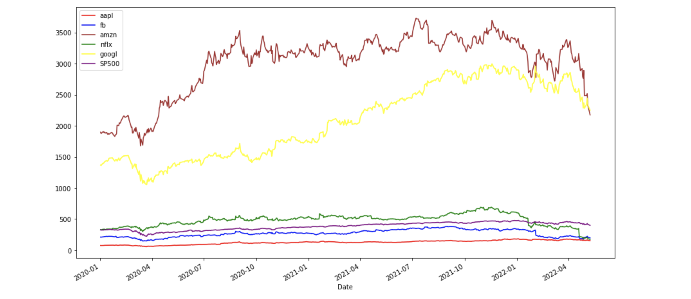
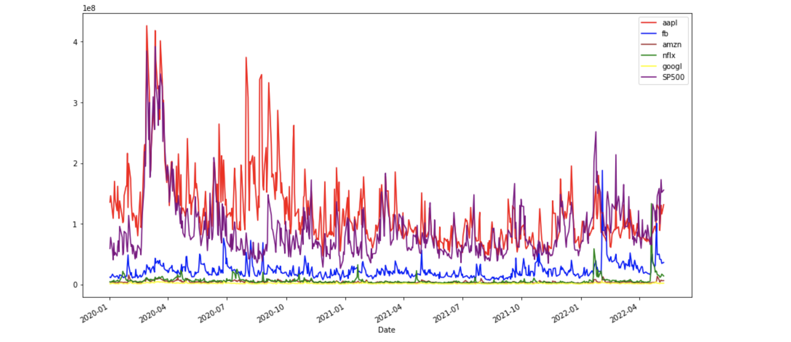
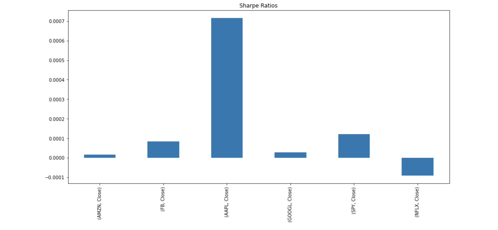
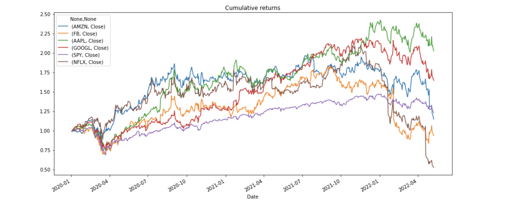
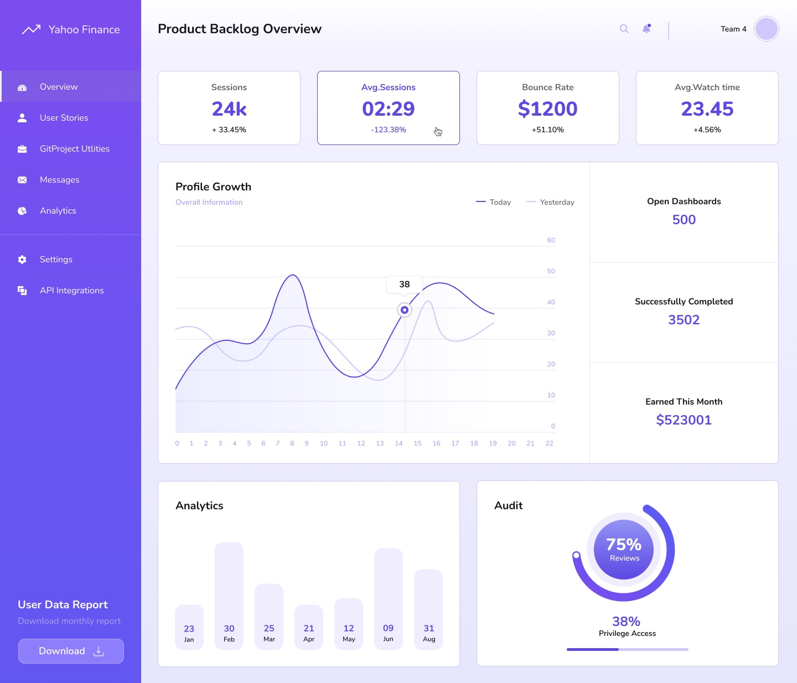

# Financial Modeling

Financial modeling to decide the best stock to invest in based on risk and performance

---

## Technologies

This project utilizes python 3.10.4 with the following libraries:

*[OS](https://docs.python.org/3/library/os.html) - To fetch content and interact with computer os
```
*[Requests](https://docs.python-requests.org/en/master/) - Allowed us to send https requests and interact with API
```
*[Pandas](https://pandas.pydata.org/docs/) - To use the panda functions and enable analysis
```
*[Yahoo Finance](https://pypi.org/project/yfinance/) - To collect Yahoo Financial data online
```
*[Datetime](https://docs.python.org/3/library/datetime.html) - Gives ability to manipulate date
```
*hvplot - Gives ability to plot graphs
```
*numpy - Makes wokring with large data easier
```

---

## Inatallation Guide

### Create a new conda environment to avoid conflicts with other package installations:
```powershell
conda deactivate
```
```powershell
conda update conda
```
```powershell
conda create -n pyviz python=3.10.4 anaconda
```
```powershell
conda activate pyviz
```
### Install PyViz packages:
```powershell
conda install -c plotly plotly=4.13.
```
```powershell
conda install -c pyviz hvplot
```
- PyViz require NodeJS version >= 12
```powershell
conda install -c conda-forge nodejs=12
```
### Install required JupyterLab Dependencies:
```powershell
conda install -c conda-forge jupyterlab=2
```
```powershell
jupyter labextension install jupyterlab-plotly@4.13.0 --no-build
```
```powershell
jupyter labextension install @jupyter-widgets/jupyterlab-manager plotlywidget@4.13.0 --no-build
```
```powershell
jupyter labextension install @pyviz/jupyterlab_pyviz --no-build
```
```powershell
jupyter lab build
```
### Install python-dotenv
```powershell
pip install python-dotenv
```
---
## Project Documents
[Project Charter](https://docs.google.com/document/d/1PwWpAx9TNOI1_Te6dbrxN5pMoMWYN-R-o6w_eiTE7Fg/edit?usp=sharing) supplies classes for manipulating dates and times.
[Project Presentation](https://docs.google.com/presentation/d/142zyyKktEoblm1tSIeBZa16DZEpnM30K_iBPf_0D8tw/edit?usp=sharing) supplies classes for manipulating dates and times.

---
## Usage Examples

### Part 1: Collect Stock Data





### Part 2: Analyze Data


### Part 3: Product Dashboard for Yahoo Finance User Stories & Development


---
## Contributors
Initial Anthony Stallworth, Chukwuma Ochu, Ava Cazares, Yijun Liao and Gonzalo Vegas. Open Source

---
## License
None.

